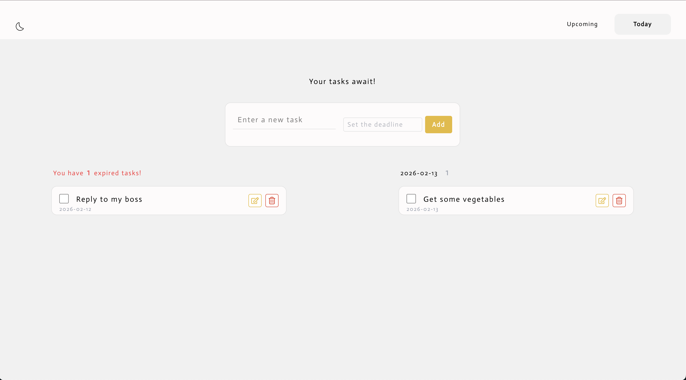
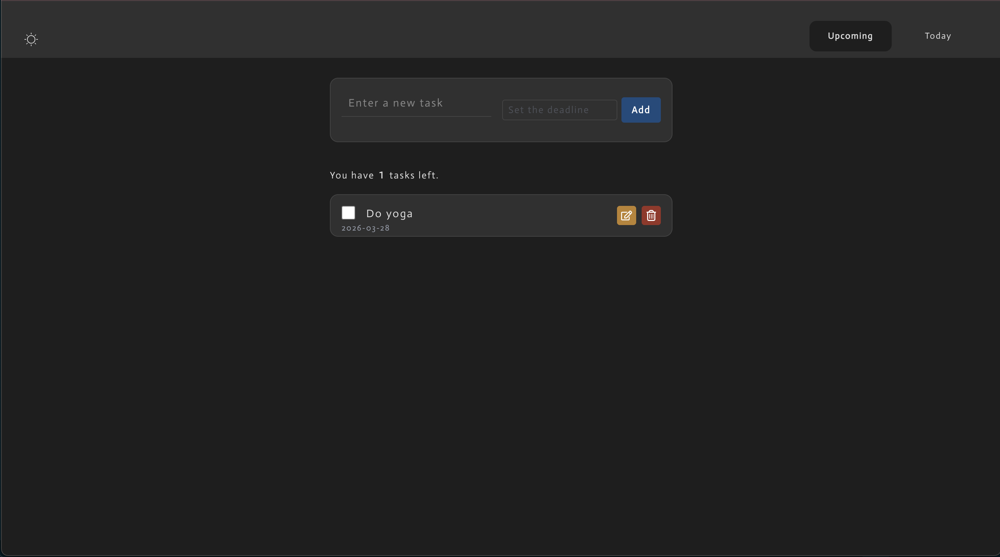

# Todo List
シンプルなタスク管理アプリです。私が初めて作ったアプリで、もともとHTML、CSS、JavaScriptで制作していましたが、学習を兼ねてReact（Next.js）で再構築しました。

 デモサイト: https://todo-list-eta-taupe.vercel.app/

<div align="center">
	
	
</div>

## 目的
このポートフォリオ作品は、 **Reactとコンポーネントベース設計の基礎を学ぶこと**、**想い通りのUIを作ること** そして **UXを意識した開発の実践** を主な目的としています。小規模なプロジェクトを通じて、状態管理、条件付きレンダリング、イベント処理など、React開発の基本的な概念を習得しました。

初めてのアプリということもあり、計画なしに機能を追加していった結果、文字列とDateオブジェクトの混在によるバグなど、多くの課題に直面しました（これを機にTypeScriptの学習用に「Hiking Log」を作成）。これ以降は、まず簡単な設計から始めるよう意識しています。

## 機能
- タスクの追加・削除  
- 完了チェック（チェック後1秒後に消えるように設定）  
- 期限切れタスクの赤字 + メインページ表示
- 日付別リストUI（今日、今後、期限切れ）  
- ローカルストレージでのデータ永続化（現在認証機能、DB連携実装中）  
- ダークモード対応  
- モバイルファーストUI

## 使った技術
- **Next.js** - Reactフレームワーク
- **JavaScript (ES6+)** - プログラミング言語
- **CSS Modules** - スタイリング
- **Tailwind CSS** - レイアウト
- **Zustand** - 状態管理


## フォルダ構成
```
Todo_list/
├── src/
│   ├── components/
│   │   ├── Header/          # ヘッダーとナビゲーション
│   │   ├── TodoForm/        # タスク作成フォーム
│   │   ├── TodoItem/        # タスクアイテムとエディター
│   │   └── TodoList/        # メインリストとヘッダー
│   ├── hooks/               # カスタムフック
│   ├── stores/              # Zustandストア
│   ├── utils/               # ユーティリティ関数
│   └── pages/               # Next.jsページ
└── public/                  # 静的アセット
```

## 工夫したこと

**UXの改善:**
- ページ遷移ボタンを右上部に設置し、親指で押しやすい設計に
- 完了済みのチェックを表示させてから1秒後に消えるUIにした（今後完了済みタスクの表示場所も追加する予定）
- 期限切れタスクをTodayページ下部に赤字で表示して視覚的に優先度を高くした
- DatePicker を使用（`input type="date"` は各デバイスでの表示ずれやplaceholderが見えずUIが悪かったため）

**技術的な課題と解決:**
- Taskのdateを保存する値を文字列とオブジェクトで混合してしまいバグが起きた
- **解決方法:** DatePickerにはstate管理したDateオブジェクトを、Taskオブジェクトには文字列化した日付を保存するようにして一貫性を保った

## トラブルシューティング

### Node.js バージョン互換性の問題

**問題・症状:**  
`npm run dev` 実行時に毎回バグ（エラー）が発生し、ローカルホストが立ち上がらない。

**原因:**  
Node.js の最新版（v22以降）は Next.js 15 との互換性に問題がある模様。

**対応:**  
最新の LTS バージョンを使用していたが、v20 にダウングレード。  
※ Homebrew 経由でインストールしていると再起動時に最新バージョンに戻ってしまうことがある。  
※ そこで一度アンインストールし、nvm 経由で公式コマンドを用いて Node.js v20 をインストールし、デフォルト設定に。

**結果:**  
以降はバグが発生していない。  
※ 完全に正解かは不明だが、現時点で安定している。

